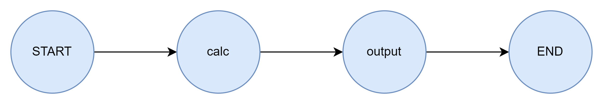
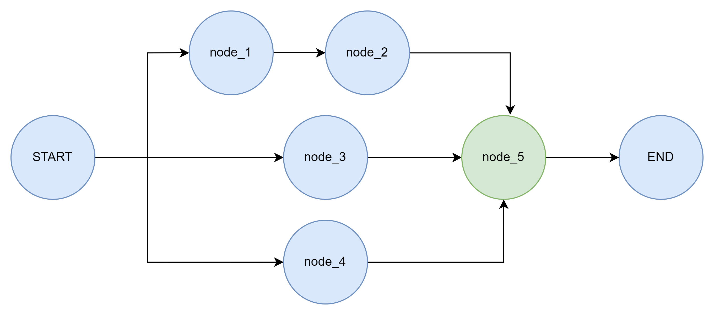
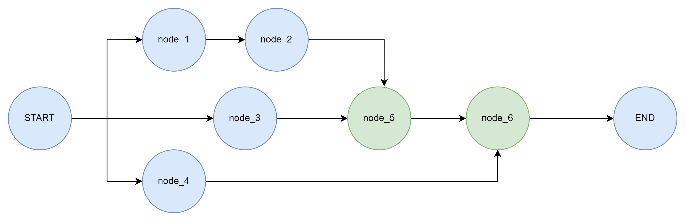
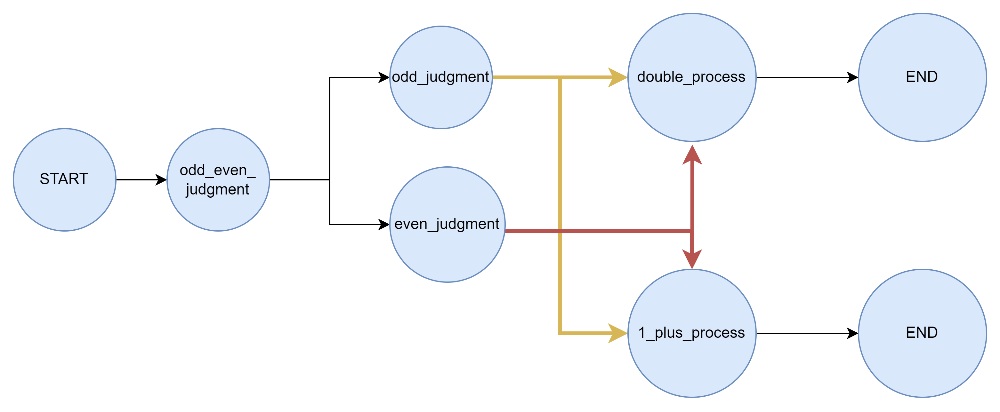

# Day01练习

结合今日学习的`LangGraph`的**状态、节点、边**三大基本组成部分，完成以下练习。对于每个练习，要求全部新建一个Python项目，创建三个脚本：`state.py`、`node.py`、`graph.py`，分别用于存放全部状态类、全部节点函数、包含条件边定义的图结构及调用实现

## 练习一

​	参考下图结构，自主决定状态结构，节点和边的关系参考下图示例，其中 `calc`节点负责参与计算，将工作流输入的 `int` 型数据进行二次幂计算，`output` 节点负责进行计算结果的输出展示。要求使用私有数据传递模式实现该计算结果的传递。

​	参考案例：3.1.1 Schema

## 练习二

​	参考下图结构，自主决定状态结构，节点和边的关系参考下图示例，要求所有拥有多个前序节点的节点全部开启延迟节点执行，自主设计输出效果，要求可以在控制台中明确看出实现了延迟节点执行的效果。

## 练习二扩展

​	思考为什么下述的图结构在加上defer= True 后，仍然会执行2次node_6

## 练习三

​	参考下图结构，自主决定状态结构，节点和边的关系参考下图示例，要求实现如下功能，首先通过条件边判断调用时传入的 `int` 型数据的奇偶性。在 `odd_process` 和 `even_process`中分别为输出奇偶性信息。然后再次通过条件边判断，大于5则翻倍并输出，小于等于5则加1并输出；

​	要求按照如下图的节点和边的关系设计，自行决定状态结构设计。

