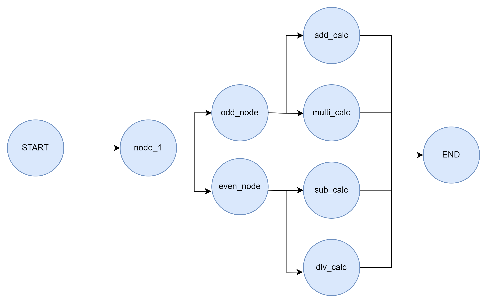
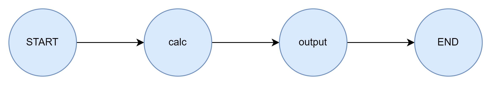

# Day02练习

## 练习一 command

​	参考下图结构，使用 `command` 实现分支选择，而非使用条件边，实现在工作流中输入一个 `int` 型参数，首先判断奇偶性进入后续节点，再并行计算 `+2 -2 ×2 ÷2`四个计算操作。

## 练习二 持久化

​	参考下图结构，使用ram持久化，第一次传入参数调用，第二次调用的时候只传入线程ID，重新显示第一次运行的结果。

## 练习三 落盘持久化

同上，改为使用 `sqlite` 存储。（重写一遍，别复制）

## 练习四 Send

​	此练习的设计流程可以参考文档中的3.4进行编写，主要核心内容为两个节点与一个条件边，实现 `send` 处理。实现逻辑：第一个节点中在状态中注册一个 `list`，其中存放5个0——100分的成绩单，通过条件边进行 `send`，在第二个节点中进行及格&不及格的判别

