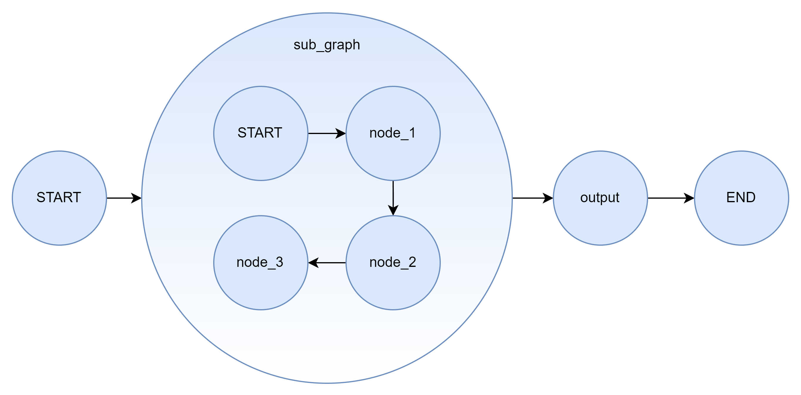
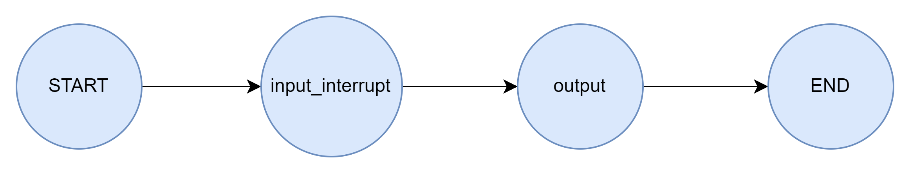
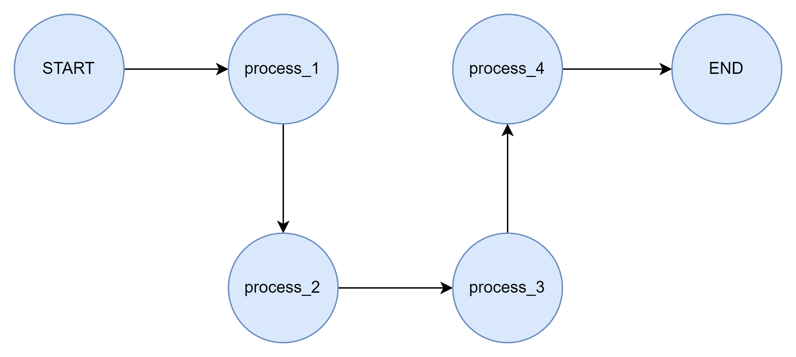

# Day03练习

## 练习一 子图

​	构建出一个图结构示意如下的包含子图作为节点的工作流，子图中设置三个独有的状态信息，并且使用流式调用，输出每一个节点处理时全部的状态信息。

​	此外，使用分别两种子图的构造注册模式进行两个案例的编写（从节点调用子图和将图添加为节点）

## 练习二 中断

​	构建一个结构如下图所示的工作流，在第一个节点处触发中断，通过传递相同进程号实现断点恢复，并实现状态信息的手动写入，在下一个节点实现输出。

## 练习三 时间旅行

​	按照下图结构构造一个工作流，在每一个节点中实现一个新状态信息的写入，然后通过时间旅行访问运行到每一个节点的状态信息历史快照，并进行输出展示。

​	再进行中间状态的恢复执行，输出展示。

