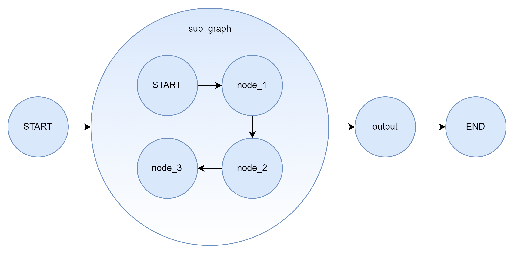
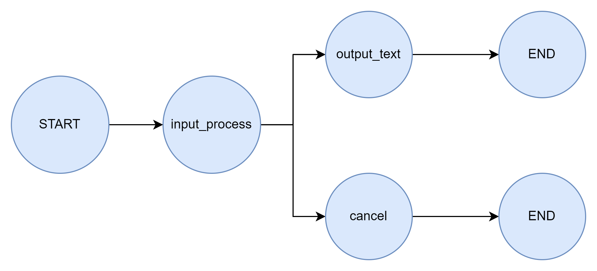
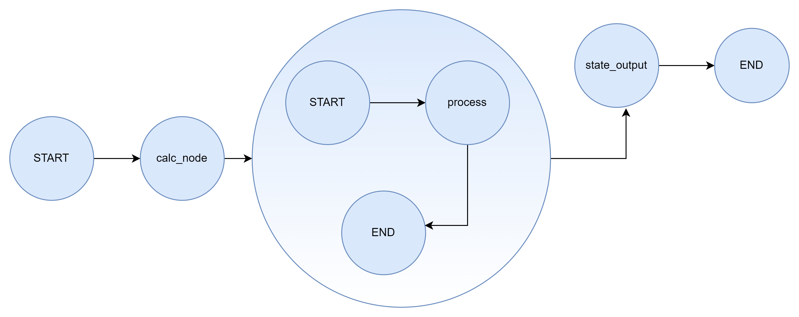
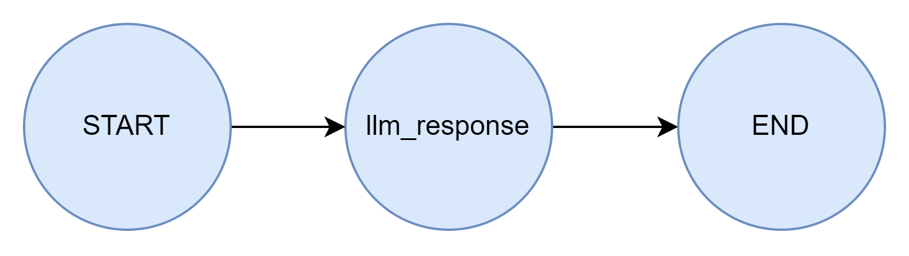
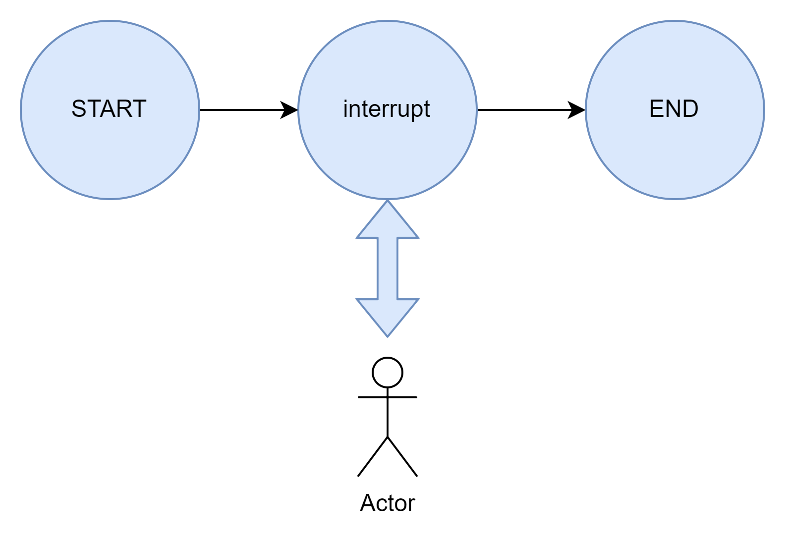

# Day04练习

## 练习一 子图	

​	构建出一个图结构示意如下的包含子图作为节点的工作流，子图中设置三个独有的状态信息，并且使用流式调用，输出每一个节点处理时全部的状态信息。

​	此外，使用分别两种子图的构造注册模式进行两个案例的编写（从节点调用子图和将图添加为节点）

## 练习二 条件边&Command

​	分别通过条件边和Command实现下图的工作流，input_process节点负责判断传入的参数长度，如果大于10则通过后续节点输出原始输入，反之通过cancel输出输入参数的实际长度

## 练习三 父图导航

​	搭建下图所示的包含子图的工作流，在子图中的process节点使用Command的父图导航功能非常规退出子图，进入state_output节点。并分析思考，在这样的工作中，子图和父图的状态在子图创建的时候和跳出的时候是如何进行的管理和同步？

## 练习四 LLM流式输出（打字机效果）

​	调用阿里百炼平台的在线大模型，进行大模型响应的流式输出的测试

## 练习五 多模式流

​	自定义图结构（至少包括三个工作节点），实现包含`updates,values,custom`三种模式的多模式流输出案例

## 练习六 中断恢复

​	参考下图结构设计，完成中断恢复功能，在中断节点中模拟进行邮件发送处理（输出一个print即可），但是需要获取人类用户的批准

